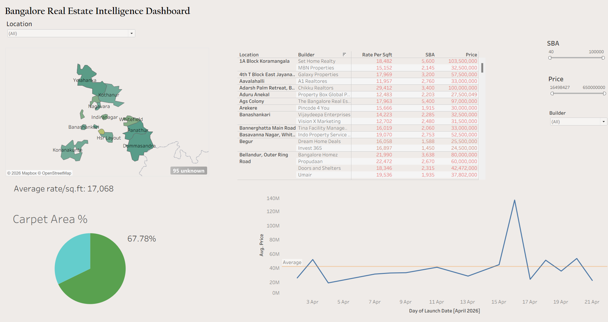

# Bangalore Real Estate Intelligence Dashboard

## Descrption
An end-to-end real estate project built to analyze residential property prices & averages across Bangalore using publicly available listing data.

The project covers the complete analytics pipeline including:
- Web scraping
- Data cleaning and transformation
- SQL database management
- Interactive dashboard visualization

---

## Dashboard Preview



---

## Features

- Average Rate/Sq.Ft analysis across Bangalore localities
- Builder-wise pricing comparison
- Carpet Area % vs Super Built-up Area (SBA) ratio
- Price trend analysis based on project launch dates
- Interactive filters for:
  - Builder
  - SBA
  - Price Range
  - Locality

---

## Tech Stack

| Technology | Purpose |
|---|---|
| Python | Data extraction and processing |
| Pandas | Data cleaning and transformation |
| Requests | Web scraping |
| PostgreSQL | Data storage and querying |
| SQL | Data analysis and aggregations |
| Tableau | Dashboard visualization |

---

## Data Pipeline

```text
MagicBricks Website
        ↓
Python Web Scraping
        ↓
Data Cleaning using Pandas and Numpy
        ↓
PostgreSQL Database
        ↓
SQL Queries
        ↓
Tableau Dashboard
